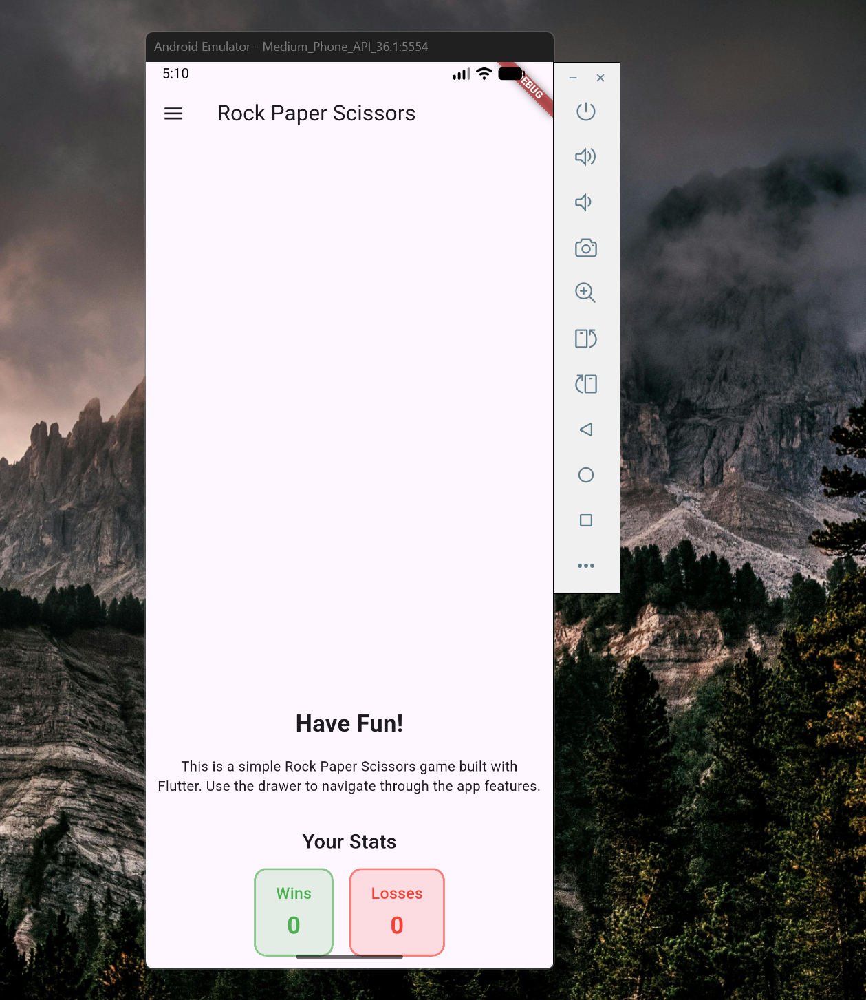
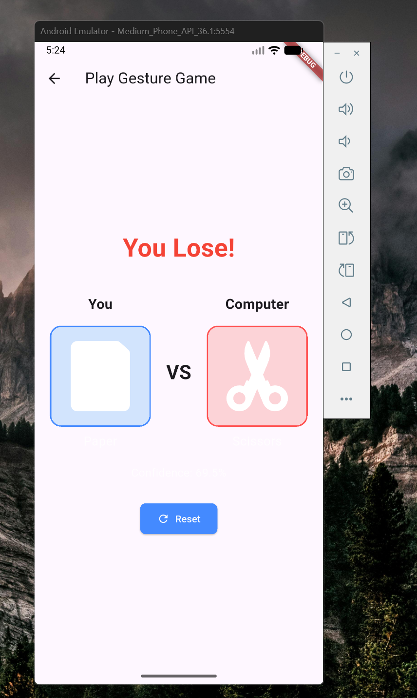

# Rock Paper Scissors – Gesture Powered Flutter App

This Flutter application lets you play Rock–Paper–Scissors using real-time hand gesture recognition. The Android native layer (Kotlin + CameraX + MediaPipe Gesture Recognizer) streams recognized gestures into Flutter via an EventChannel. The UI maps those gestures to game choices, computes the outcome, and now shows your lifetime Win/Loss stats locally using.

## Features

- Live camera preview with hand gesture recognition (MediaPipe Tasks)
- Gesture → Game choice mapping (Victory=Scissors, Open_Palm=Paper, Closed_Fist / Pointing_Up=Rock)
- Result screen with SVG illustrations
- Persistent stats (wins / losses) stored locally
- Modular architecture with clear separation (native camera, gesture helper, Flutter UI components, persistence layer)

## Screenshots

| Home                          | Play Area                          | Result                              |
| ----------------------------- | ---------------------------------- | ----------------------------------- |
|  |  |  |


## Videos

https://github.com/user-attachments/assets/d83376c4-b97b-4367-aab4-899f167c015b


https://github.com/user-attachments/assets/08a2115a-53b2-4348-9581-5e7d3741a348


## Tech Stack

| Layer              | Tech                                          |
| ------------------ | --------------------------------------------- |
| UI                 | Flutter (Material 3, SVG assets)              |
| State Sharing      | InheritedNotifier (`GameStatsProvider`)       |
| Persistence        | `localstore` key–value store                  |
| Native Camera / ML | Kotlin, CameraX, MediaPipe Gesture Recognizer |
| Platform Bridge    | Flutter PlatformView + EventChannel           |

## Architecture Overview

```
+------------------------------+
| Flutter                      |
|  HomeApp / GamePage          |
|        |                    |
|  GameArea (gesture consumer) |
|        |                    |
|  GameStatsProvider (Inherited) <---> localstore
|        |                    |
|  Result / ResetButton        |
+------------------------------+
							^ EventChannel (JSON map)
							|
+------------------------------+
| Android Native (Kotlin)      |
|  CameraView (PlatformView)   |
|  GestureRecognizerHelper     |
|  CameraX + ImageAnalysis     |
+------------------------------+
```

### Gesture Flow

1. CameraX delivers frames to `GestureRecognizerHelper`.
2. MediaPipe returns the highest-confidence gesture.
3. Kotlin sends `{ gestureName, confidence, timestamp }` via EventChannel.
4. Flutter `CameraView` widget triggers `onGestureDetected` callback.
5. Gesture mapped to game choice via constants (`gestureOutputMap`).
6. Game result computed and stats updated through `GameStatsProvider.recordResult()`.
7. UI shows SVG result + updated stats.

## Persistence Layer

Files:

- `lib/models/game_stats.dart` – immutable `GameStats` + `GameStatsNotifier`.
- `lib/services/game_stats_repository.dart` – load/save/increment via `localstore`.
- `lib/state/game_stats_provider.dart` – InheritedNotifier wrapper exposing `stats` and `recordResult()`.
- Constants for keys in `lib/constants.dart` (`statsCollection`, `statsDocId`, field names, labels).

### Data Schema (localstore document)

```
collection: game_stats
document:  rps
{
	"wins": <int>,
	"losses": <int>
}
```

## Setup & Run

Ensure you have Flutter SDK installed.

```cmd
flutter pub get
flutter run
```

Android permissions: The app requests camera access via a method channel.

## Key Constants (`constants.dart`)

- `gestureOutputMap` – maps gesture names to game moves.
- `winningConditions` – determines winner logic.
- `statsCollection`, `statsDocId`, `statsFieldWins`, `statsFieldLosses` – persistence keys.
- `statsTitle`, `winsLabel`, `lossesLabel` – UI labels.

## Adding New Gestures

1. Extend MediaPipe configuration if needed.
2. Map new gesture name in `gestureOutputMap`.
3. Adjust `winningConditions` if introducing new move types.

## Edge Cases Handled

- First run: missing doc → defaults to 0 wins / 0 losses.
- Ties: ignored (no stat increment) via guard in `recordResult()`.
- Rapid recognitions: each result processed sequentially; provider updates value after repository persistence.
- Disposed camera view: analyzer halted before gesture recognizer close to avoid crashes.

## Future Improvements

- Add tie count & reset stats button.
- Add unit tests for repository/provider.
- Support multiple gesture sets or difficulty levels.
- Implement offline batching if many quick results.

## Troubleshooting

| Issue                      | Cause                  | Fix                                                              |
| -------------------------- | ---------------------- | ---------------------------------------------------------------- |
| Stats not updating         | Provider not found     | Ensure `GameStatsProvider` wraps `HomeApp` in `main.dart`        |
| Crash after closing camera | Analyzer still running | Confirm disposal sequence in `CameraView` (clear analyzer first) |
| Gesture always Rock        | Mapping missing        | Verify `gestureOutputMap` matches recognized gesture names       |

## License

Internal project. Add licensing info if distributing.
